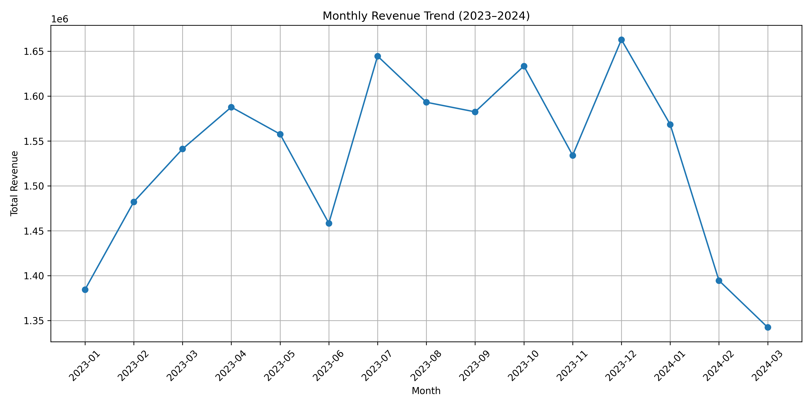
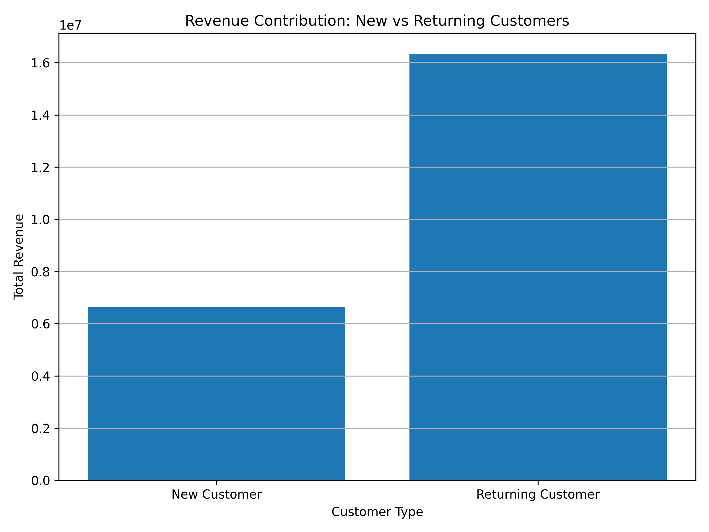
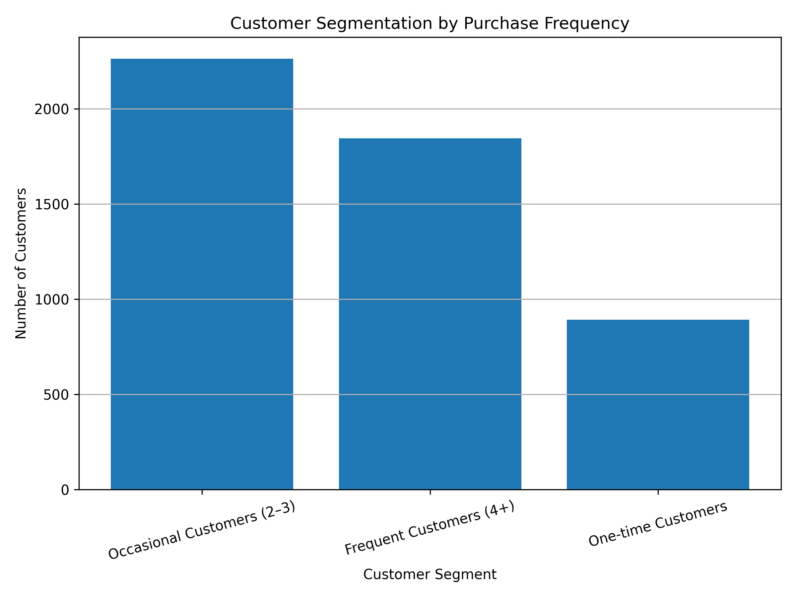

# Customer Growth Analytics using Data-Driven Analytics and Intelligent Automation

## Strategic Positioning

This project demonstrates applied decision intelligence in customer growth strategy.  
Rather than focusing purely on descriptive analytics, the analysis evaluates how behavioural customer data can inform structured, automation-ready decision frameworks while preserving human oversight.

The emphasis is on:
- Revenue stability through retention insight  
- Responsible intelligent automation design  
- Segment-driven operational decision support  
- Explainable analytics for executive use
## Executive Summary

This project demonstrates how structured customer analytics can be translated into responsible automation strategy within a digital business environment.

Using recent transactional data (2023–2024), the analysis identifies revenue stability patterns, quantifies the impact of customer retention, and builds interpretable behavioural segments. The core objective is not automation for its own sake, but automation grounded in decision accountability, predictability, and explainability.

The project showcases the ability to:
- Translate raw transactional data into strategic decision-support insights
- Identify automation-safe zones based on behavioural stability
- Balance efficiency with governance and oversight
- Build analytics frameworks aligned with business risk management

This work reflects applied analytics leadership rather than experimental modelling.

## Project Overview

This project explores how customer transaction data can be used to support better business decisions and more responsible approaches to intelligent automation. Using recent e-commerce data (2023–2024), the work focuses on understanding customer behaviour, revenue trends, retention patterns, and segmentation.

Rather than treating analytics as an end product, the project approaches analysis as a decision-support exercise. Each insight is evaluated based on whether it can realistically inform an action, and whether that action would be appropriate to automate in a real organisational setting.

The work demonstrates how raw customer data can be transformed into decision-support insights for modern digital businesses, with a focus on analytics-driven automation and personalisation strategies.

## Dataset Description

The analysis uses an anonymised e-commerce transaction dataset containing customer purchase records between 2023 and 2024.  
Key fields include transaction date, customer identifier, purchase value, and order frequency indicators used for behavioural segmentation.
## Project Objectives

- Analyse recent e-commerce transaction data
- Identify revenue and seasonality trends
- Quantify the impact of customer retention
- Segment customers to support intelligent automation
- Demonstrate applied, real-world data analytics skills

## Project Milestones

### Milestone 1: Revenue Trend Analysis (Completed)
- Validated and analysed recent e-commerce transaction data (2023–2024)
- Engineered revenue metrics from transactional data
- Identified temporal revenue and seasonality patterns
- Linked insights to intelligent automation opportunities in acquisition and marketing

### Milestone 2: Customer Retention Impact Analysis (Completed)
- Analysed revenue contribution of returning vs new customers
- Quantified the strategic importance of customer retention
- Identified opportunities for automated re-engagement and personalisation

### Milestone 3: Customer Segmentation for Intelligent Automation (Completed)
- Built customer-level RFM-style features
- Segmented customers into actionable behavioural groups
- Demonstrated how analytics enables intelligent automation and personalised decision-making

## Tools & Technologies

- Python
- Pandas, NumPy
- Matplotlib
- Jupyter Notebooks (Google Colab)
- GitHub for version control and evidence tracking

## Automation Decision Governance Matrix (Prototype)

This matrix summarises which customer-growth decisions are appropriate to automate, and where human oversight remains essential.

| Decision area | Automate? | Risk level | Recommended human oversight |
|---|---:|---:|---|
| Monthly revenue monitoring | Yes | Low | Monthly review of anomalies |
| Retention re-engagement triggers (returning customers) | Yes (guardrails) | Medium | Threshold review + opt-out governance |
| Customer segmentation updates | Partially | Medium | Quarterly segment drift review |
| Individual customer targeting intensity | Cautious | Medium–High | Policy limits + fairness review |
| Pricing / discount automation | No (in this prototype) | High | Commercial + compliance approval |

## Innovation Contribution

This project extends beyond descriptive marketing analytics by introducing a structured decision-support perspective to customer growth analysis.

Rather than focusing solely on campaign performance or dashboard reporting, the analysis decomposes revenue into acquisition, retention, and behavioural contribution layers. This enables organisations to identify structural growth drivers and translate analytics insights into automation-ready operational frameworks.

The project therefore demonstrates how customer analytics can evolve from retrospective reporting toward interpretable decision architecture supporting marketing prioritisation, customer engagement strategy, and retention-driven growth.

## Outcome

This project demonstrates how structured analytics can be transformed into decision-ready intelligence for digital businesses.

The outputs support:

- Automated marketing prioritisation frameworks  
- Retention-focused resource allocation  
- Segment-aware customer engagement logic  
- Risk-aware intelligent automation design  

The emphasis remains on explainability, governance awareness, and operational realism rather than experimental modelling.
## Strategic Relevance

While based on e-commerce transaction data, the analytical framework developed in this project is transferable to broader sectors including enterprise sales, subscription services, and digital platforms.

The decision-support structure — combining revenue analysis, retention focus, behavioural segmentation, and governance constraints — provides a replicable model for responsible automation strategy in data-driven organisations.

## Key Visual Outputs

The following visualisations were generated directly from the project analysis to support the written insights and findings:

- Monthly revenue trend analysis highlighting seasonality patterns  
- Revenue contribution comparison between new and returning customers  
- Customer segmentation by purchase frequency  
- Revenue contribution by customer segment  

All visual outputs are available in the `/images` directory of this repository.
---
## Decision-Support Insights

Key insights derived from the analysis include:

* Revenue stability is strongly influenced by returning customer behaviour rather than acquisition alone.  
* Behavioural segmentation enables organisations to identify automation-safe engagement triggers.  
* Segment-aware engagement strategies can reduce inefficient marketing spend while strengthening retention outcomes.  
* Decision-support frameworks built on interpretable analytics improve operational clarity for marketing and growth teams.

## Visual Evidence

### Monthly Revenue Trend

### New vs Returning Revenue Contribution

### Customer Segment Distribution

---
## Related Writing

Insights from this project are explored further in long-form articles published on Medium, focusing on decision-making, customer behaviour, and responsible intelligent automation.
A summary of public publications is available in PUBLICATIONS.md.

---

## Methodology & Analytical Boundaries

This project applies structured exploratory data analysis (EDA) to transactional data from 2023–2024 to derive customer behaviour insights relevant to acquisition, retention, and automation design.

### Methodological Approach
- Data validation and preprocessing (date normalization, revenue consistency checks)
- Time-series aggregation to identify revenue patterns and seasonality
- Customer-level feature engineering (frequency, recency-style logic)
- Behavioural segmentation based on observable purchase patterns
- Comparative revenue contribution analysis (new vs returning customers)

The analysis prioritised interpretability over complexity to ensure insights remain decision-ready and operationally actionable.

---

## Limitations & Governance Awareness

This project intentionally does not:
- Use personally identifiable information (PII)
- Deploy predictive machine learning models
- Automate live decision systems
- Infer demographic characteristics
- Optimise pricing dynamically

The focus remains on decision-support analytics rather than production deployment.

Segments and automation recommendations should be periodically reviewed in live environments to prevent segment drift and misalignment with evolving customer 
behaviour.

## Strategic Automation Decision Framework

To ensure analytics insights translate into responsible automation, this project introduces a structured decision framework used to evaluate whether a process should be automated.

The framework evaluates:

1. Stability – Is the signal consistent over time?
2. Predictability – Can behaviour be forecasted with acceptable risk?
3. Interpretability – Can the logic be explained to stakeholders?
4. Reversibility – Can automated actions be paused or overridden?
5. Governance Impact – Does the decision affect fairness, pricing, or customer trust?

Only processes meeting defined thresholds across these dimensions are considered suitable for automation.

This approach demonstrates a leadership-oriented mindset toward intelligent automation, prioritising oversight, accountability, and long-term organisational trust.

## Repository Structure

- `/data` – Source dataset used for analysis
- `/notebooks` – Jupyter notebooks (Google Colab compatible)
- `/images` – Generated visual outputs
- `TECHNICAL_NOTES.md` – Technical reflections and reasoning
- `DECISION_FRAMEWORK.md` – Automation decision support and governance layer

This framework promotes responsible automation rather than aggressive automation.

